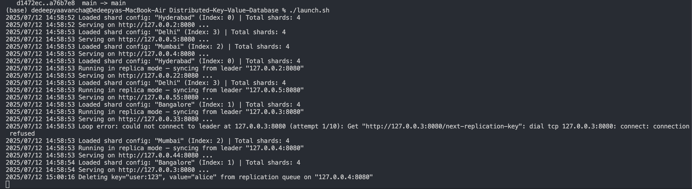

# Distributed Key-Value Database

This project implements a distributed key-value database in Go, featuring static sharding, and replication.

## Outputs

### Screenshots

Notice the four shards are in the `sharding.toml` file, and the addresses are set to loopback addresses for local testing. The servers are running on different ports, and the replication is set up to pull from the leader.

There are four shards.
shard 0: Hyderabad - `127.0.0.2:8080`, replica: `127.0.0.22:8080`
shard 1: Bangalore - `127.0.0.3:8080`, replica: `127.0.33:8080`
shard 2: Mumbai - `127.0.0.4:8080`, replica: `127.0.0.44:8080`
shard 3: Delhi - `127.0.0.5:8080`, replica: `127.0.55:8080`



- Some outputs on curl requests to the endpoints. If you try to get set or get key from the wrong shard, it will redirect you to the correct shard. Reads from either leadr or replica are supported, but writes are only allowed on the leader. The replica is read-only, and it polls the leader for replication. Replica is read only just for safety purposes and to reduce complexity.


- This one is on adding print statements to the endpoints in `transport/transport.go` to show the flow of requests and responses, especially for replication and sharding. I seeded using `./seed_shard.sh`, that puts 10 random keys in only one of the shards(redirects happen).
- Emojis also added for readability, these are commented out for brevity now, so you can uncomment them if you want to see the output with emojis.

```bash
2025/07/12 15:17:12 Serving on http://127.0.0.33:8080 ...
➡️ PUT /set?key=key-539287336&value=value-1 → target shard: 3 | current shard: 0
🔁 Redirecting SET request to correct shard
➡️ PUT /set?key=key-539287336&value=value-1 → target shard: 3 | current shard: 3
✅ SET served locally: key=key-539287336, value=value-1, error=<nil>
➡️ PUT /set?key=key-7986636&value=value-2 → target shard: 2 | current shard: 0
🔁 Redirecting SET request to correct shard
➡️ PUT /set?key=key-7986636&value=value-2 → target shard: 2 | current shard: 2
✅ SET served locally: key=key-7986636, value=value-2, error=<nil>
➡️ PUT /set?key=key-125779434&value=value-3 → target shard: 3 | current shard: 0
🔁 Redirecting SET request to correct shard
➡️ PUT /set?key=key-125779434&value=value-3 → target shard: 3 | current shard: 3
✅ SET served locally: key=key-125779434, value=value-3, error=<nil>
➡️ PUT /set?key=key-291864019&value=value-4 → target shard: 1 | current shard: 0
🔁 Redirecting SET request to correct shard
➡️ PUT /set?key=key-291864019&value=value-4 → target shard: 1 | current shard: 1
2025/07/12 15:17:24 Deleting key="key-125779434", value="value-3" from replication queue on "127.0.0.5:8080"
🧼 REPLICATION ACK: Deleting key=key-125779434, value=value-3 from queue
✅ SET served locally: key=key-291864019, value=value-4, error=<nil>
✅ REPLICATION DELETE successful
➡️ PUT /set?key=key-550710753&value=value-5 → target shard: 0 | current shard: 0
2025/07/12 15:17:24 Deleting key="key-539287336", value="value-1" from replication queue on "127.0.0.5:8080"
🧼 REPLICATION ACK: Deleting key=key-539287336, value=value-1 from queue
✅ SET served locally: key=key-550710753, value=value-5, error=<nil>
✅ REPLICATION DELETE successful
➡️ PUT /set?key=key-51863328&value=value-6 → target shard: 3 | current shard: 0
🔁 Redirecting SET request to correct shard
➡️ PUT /set?key=key-51863328&value=value-6 → target shard: 3 | current shard: 3
✅ SET served locally: key=key-51863328, value=value-6, error=<nil>
➡️ PUT /set?key=key-546221475&value=value-7 → target shard: 1 | current shard: 0
🔁 Redirecting SET request to correct shard
➡️ PUT /set?key=key-546221475&value=value-7 → target shard: 1 | current shard: 1
✅ SET served locally: key=key-546221475, value=value-7, error=<nil>
➡️ PUT /set?key=key-63757650&value=value-8 → target shard: 2 | current shard: 0
🔁 Redirecting SET request to correct shard
➡️ PUT /set?key=key-63757650&value=value-8 → target shard: 2 | current shard: 2
✅ SET served locally: key=key-63757650, value=value-8, error=<nil>
➡️ PUT /set?key=key-552286593&value=value-9 → target shard: 0 | current shard: 0
✅ SET served locally: key=key-552286593, value=value-9, error=<nil>
➡️ PUT /set?key=key-676220700&value=value-10 → target shard: 3 | current shard: 0
🔁 Redirecting SET request to correct shard
➡️ PUT /set?key=key-676220700&value=value-10 → target shard: 3 | current shard: 3
2025/07/12 15:17:24 Deleting key="key-550710753", value="value-5" from replication queue on "127.0.0.2:8080"
🧼 REPLICATION ACK: Deleting key=key-550710753, value=value-5 from queue
2025/07/12 15:17:24 Deleting key="key-291864019", value="value-4" from replication queue on "127.0.0.3:8080"
2025/07/12 15:17:24 Deleting key="key-63757650", value="value-8" from replication queue on "127.0.0.4:8080"
🧼 REPLICATION ACK: Deleting key=key-63757650, value=value-8 from queue
🧼 REPLICATION ACK: Deleting key=key-291864019, value=value-4 from queue
✅ SET served locally: key=key-676220700, value=value-10, error=<nil>
✅ REPLICATION DELETE successful
✅ REPLICATION DELETE successful
✅ REPLICATION DELETE successful
2025/07/12 15:17:24 Deleting key="key-552286593", value="value-9" from replication queue on "127.0.0.2:8080"
🧼 REPLICATION ACK: Deleting key=key-552286593, value=value-9 from queue
2025/07/12 15:17:24 Deleting key="key-546221475", value="value-7" from replication queue on "127.0.0.3:8080"
2025/07/12 15:17:24 Deleting key="key-7986636", value="value-2" from replication queue on "127.0.0.4:8080"
🧼 REPLICATION ACK: Deleting key=key-7986636, value=value-2 from queue
🧼 REPLICATION ACK: Deleting key=key-546221475, value=value-7 from queue
✅ REPLICATION DELETE successful
✅ REPLICATION DELETE successful
✅ REPLICATION DELETE successful
2025/07/12 15:17:24 Deleting key="key-51863328", value="value-6" from replication queue on "127.0.0.5:8080"
🧼 REPLICATION ACK: Deleting key=key-51863328, value=value-6 from queue
✅ REPLICATION DELETE successful
2025/07/12 15:17:24 Deleting key="key-676220700", value="value-10" from replication queue on "127.0.0.5:8080"
🧼 REPLICATION ACK: Deleting key=key-676220700, value=value-10 from queue
✅ REPLICATION DELETE successful
```

- After running the above, I am running some gets based on key and values populted with above (the key is a random number).

```bash
# Check if replica of Delhi (shard 3) has the correct key
curl "http://127.0.0.55:8080/get?key=key-676220700"
curl "http://127.0.0.55:8080/get?key=key-125779434"
curl "http://127.0.0.55:8080/get?key=key-51863328"

# Check Mumbai replica (shard 2)
curl "http://127.0.0.44:8080/get?key=key-7986636"
curl "http://127.0.0.44:8080/get?key=key-63757650"

# Check Bangalore replica (shard 1)
curl "http://127.0.0.33:8080/get?key=key-291864019"
curl "http://127.0.0.33:8080/get?key=key-546221475"

# Check Hyderabad replica (shard 0)
curl "http://127.0.0.22:8080/get?key=key-550710753"
curl "http://127.0.0.22:8080/get?key=key-552286593"

# Check Hyderabad leader (shard 0)
curl "http://127.0.0.2:8080/get?key=key-550710753"
# Check for redirection
curl "http://127.0.0.3:8080/get?key=key-550710753"
```

Output:

```bash
➡️ GET /get?key=key-676220700 → target shard: 3 | current shard: 3
✅ GET served locally: key=key-676220700, value=value-10, error=<nil>
➡️ GET /get?key=key-125779434 → target shard: 3 | current shard: 3
✅ GET served locally: key=key-125779434, value=value-3, error=<nil>
➡️ GET /get?key=key-7986636 → target shard: 2 | current shard: 2
✅ GET served locally: key=key-7986636, value=value-2, error=<nil>
➡️ GET /get?key=key-51863328 → target shard: 3 | current shard: 3
✅ GET served locally: key=key-51863328, value=value-6, error=<nil>
➡️ GET /get?key=key-291864019 → target shard: 1 | current shard: 1
✅ GET served locally: key=key-291864019, value=value-4, error=<nil>
➡️ GET /get?key=key-546221475 → target shard: 1 | current shard: 1
✅ GET served locally: key=key-546221475, value=value-7, error=<nil>
➡️ GET /get?key=key-550710753 → target shard: 0 | current shard: 0
✅ GET served locally: key=key-550710753, value=value-5, error=<nil>
➡️ GET /get?key=key-552286593 → target shard: 0 | current shard: 0
✅ GET served locally: key=key-552286593, value=value-9, error=<nil>
➡️ GET /get?key=key-550710753 → target shard: 0 | current shard: 0
✅ GET served locally: key=key-550710753, value=value-5, error=<nil>
➡️ GET /get?key=key-550710753 → target shard: 0 | current shard: 1
🔁 Redirecting GET request to correct shard
➡️ GET /get?key=key-550710753 → target shard: 0 | current shard: 0
✅ GET served locally: key=key-550710753, value=value-5, error=<nil>
```

- If you uncomment the print statement for GetNextKeyForReplication:

It would look something like this:

I just made one curl request to Hyderabad to set key foo to value bar.
Replicas are constantly pulling, and most of it is empty. On receiving the set request it gets redirected to Delhi, the correct shard for that key. So one of the entries, key and value are not emtpy. Then we see the replication queue of Delhi being cleared of that entry after replica acks the pull.

```bash
📤 Hyd: REPLICATION PULL: key=, value=, err=<nil>
🔁 Redirecting SET request to correct shard
📤 Bom: REPLICATION PULL: key=, value=, err=<nil>
📤 Blr: REPLICATION PULL: key=, value=, err=<nil>
📤 Del: REPLICATION PULL: key=foo, value=bar, err=<nil>
2025/07/12 15:54:19 Deleting key="foo", value="bar" from replication queue on "127.0.0.5:8080"
📤 Del: REPLICATION PULL: key=, value=, err=<nil>
📤 Hyd: REPLICATION PULL: key=, value=, err=<nil>
📤 Bom: REPLICATION PULL: key=, value=, err=<nil>
```

On powering down:

```bash
^C
Caught SIGINT or exit. Cleaning up...
signal: interrupt
signal: interrupt
signal: interrupt
signal: interrupt
signal: interrupt
signal: interrupt
signal: interrupt
signal: interrupt
Cleaned up data/ and stopped servers.

Caught SIGINT or exit. Cleaning up...
Cleaned up data/ and stopped servers.
```

This distributed key-value database implements a horizontally scalable architecture with the following key components and concepts:

### Architecture Overview

The system consists of **4 shards** (Hyderabad, Bangalore, Mumbai, Delhi), each with a **leader-replica pair** for high availability. Data is automatically partitioned across shards using consistent hashing, and each shard maintains its own local database with asynchronous replication to its replica. Each shard is a standalone key-value server that stores data in a BoltDB file, listens on a specific address, and optionally runs as a replica (polls the leader). Replicas are read only, this is just for safety incase there are multiple replicas and you don't write to both at the same time.

```
┌─────────────────┐    ┌─────────────────┐    ┌─────────────────┐    ┌─────────────────┐
│   Hyderabad     │    │   Bangalore     │    │     Mumbai      │    │      Delhi      │
│                 │    │                 │    │                 │    │                 │
│ Leader: 127.0.0.2   │ Leader: 127.0.0.3   │ Leader: 127.0.0.4   │ Leader: 127.0.0.5   │
│ Replica: 127.0.0.22  │ Replica: 127.0.0.33  │ Replica: 127.0.0.44  │ Replica: 127.0.0.55  │
└─────────────────┘    └─────────────────┘    └─────────────────┘    └─────────────────┘
```

### Key Concepts

#### 1. **Sharding Strategy**

- **Consistent Hashing**: Uses FNV-64 hash function to deterministically map keys to shards
- **Key Distribution**: `shard_index = hash(key) % total_shards`
- **Automatic Routing**: Requests are automatically redirected to the correct shard
- **Load Balancing**: Keys are evenly distributed across all shards

#### 2. **Replication Model**

- **Leader-Replica Pattern**: Each shard has one leader and one replica
- **Asynchronous Replication**: Pull-based replication from leader to replica
- **Eventually Consistent**: Replicas may lag behind leaders but will eventually catch up
- **Fault Tolerance**: If a leader fails, the replica can take over (manual failover required)

#### 3. **Data Storage**

- **BoltDB**: Embedded key-value store using B+ tree for efficient range queries
- **Dual Buckets**:
  - `default` bucket: Main data storage
  - `replication` bucket: Queue for pending replication operations
- **ACID Transactions**: All operations are atomic and consistent

#### 4. **Communication Protocol**

- **HTTP API**: RESTful interface for client operations
- **Custom Binary Protocol**: Internal communication between nodes
- **JSON Encoding**: For replication coordination messages

### Data Flow Examples

#### Write Operation (SET)

```
1. Client sends: PUT /set?key=user:123&value=john_doe
2. System hashes "user:123" → determines shard (e.g., Bangalore)
3. Request routed to Bangalore leader (127.0.0.3:8080)
4. Leader writes to local BoltDB (both default and replication buckets)
5. Replica (127.0.0.33:8080) polls leader for replication queue
6. Replica applies change and acknowledges deletion from queue
```

#### Read Operation (GET)

```
1. Client sends: GET /get?key=user:123
2. System hashes "user:123" → determines shard (e.g., Bangalore)
3. Request routed to Bangalore leader (127.0.0.3:8080)
4. Leader reads from local BoltDB and returns value
```

#### Cross-Shard Request

```
1. Client sends: GET /get?key=user:456 to Hyderabad (127.0.0.2:8080)
2. Hyderabad hashes "user:456" → determines it belongs to Mumbai
3. Hyderabad redirects request to Mumbai (127.0.0.4:8080)
4. Mumbai processes request and returns response
```

### Replication Process

The replication system uses a **pull-based model** with the following steps:

1. **Leader writes** data to both `default` and `replication` buckets
2. **Replica polls** leader every 100ms for new replication keys
3. **Leader responds** with next key-value pair from replication queue
4. **Replica applies** the change to its local database
5. **Replica acknowledges** successful replication by requesting key deletion
6. **Leader removes** the key from replication queue

### Configuration

The system is configured via `sharding.toml`:

```toml
[[shards]]
name = "Hyderabad"
idx = 0
address = "127.0.0.2:8080"
replicas = ["127.0.0.22:8080"]
```

### Performance Characteristics

- **Horizontal Scaling**: Add more shards to increase capacity
- **High Availability**: Replica nodes provide fault tolerance
- **Low Latency**: Local reads and writes within each shard
- **Eventually Consistent**: Replicas may have slight data lag
- **No Cross-Shard Transactions**: Each shard operates independently

### Limitations and Considerations

- **Single Point of Failure**: No automatic leader election
- **Manual Failover**: Replica promotion requires manual intervention
- **No Cross-Shard Transactions**: Cannot guarantee consistency across shards
- **Fixed Shard Count**: Adding/removing shards requires rehashing all data
- **Network Partition Handling**: Limited handling of network splits

## Features

- **Sharding:** Data is partitioned across multiple shards, allowing for horizontal scaling and improved performance.
- **Replication:** Each shard has a leader and a set of replicas, ensuring data redundancy and high availability.
- **Custom Binary Protocol:** A custom binary protocol is used for efficient data transfer between nodes.
- **HTTP API:** A simple HTTP API is provided for setting, getting, and deleting keys.
- **Benchmarking Tool:** A benchmarking tool is included for performance testing.

## Getting Started

### Prerequisites

- Go 1.18 or higher

### Installation

0.

Ensure you have Go installed on your machine.
`echo 'export PATH="$HOME/go/bin:$PATH"' >> ~/.zshrc`
`source ~/.zshrc`
`go install ./cmd/kv`
`go install ./cmd/benchclient`
`which kv` # should show the path to the binary

```bash
kv             ← used by launch.sh (server)
benchclient    ← used for load testing
```

You might need to do this

```bash
sudo ifconfig lo0 alias 127.0.0.2
sudo ifconfig lo0 alias 127.0.0.3
sudo ifconfig lo0 alias 127.0.0.4
sudo ifconfig lo0 alias 127.0.0.5
sudo ifconfig lo0 alias 127.0.0.22
sudo ifconfig lo0 alias 127.0.0.33
sudo ifconfig lo0 alias 127.0.0.44
sudo ifconfig lo0 alias 127.0.0.55
```

and

clean up ports incase of existing processes

```bash
for ip in 2 22 3 33 4 44 5 55; do lsof -nP -i@127.0.0.$ip:8080 | awk 'NR>1 {print $2}' | xargs kill -9 2>/dev/null || true; done

```

You can play around running a single leader like this

```bash
go run ./cmd/kv \
  -db-location=data/hyderabad.db \
  -http-addr=127.0.0.2:8080 \
  -config-file=sharding.toml \
  -shard=Hyderabad
```

1.  Clone the repository:

    ```bash
    git clone https://github.com/dd1235/distributed-key-value-database.git
    ```

2.  Install the dependencies:

    ```bash
    go mod tidy
    ```

### Usage

1.  Launch the database:

    ```bash
    ./launch.sh
    ```

2.  Seed the database with data:

    ```bash
    ./seed_shard.sh
    ```

3.  Interact with the database using the HTTP API:

    ```bash
    # Set a key
    curl "http://127.0.0.2:8080/set?key=my-key&value=my-value"

    # Get a key
    curl "http://127.0.0.2:8080/get?key=my-key"
    ```

## Project Structure

```
.
├── cmd
│   └── benchclient
│       └── main.go
|   └── kv
│       └── main.go
├── config
│   ├── config.go
│   └── config_test.go
├── db
│   ├── db.go
│   └── db_test.go
├── replication
│   └── replication.go
├── transport
│   ├── transport.go
│   └── transport_test.go
├── .gitignore
├── go.mod
├── go.sum
├── launch.sh
├── main.go
├── notes.md
├── readme.md
├── seed_shard.sh
└── sharding.toml
```
